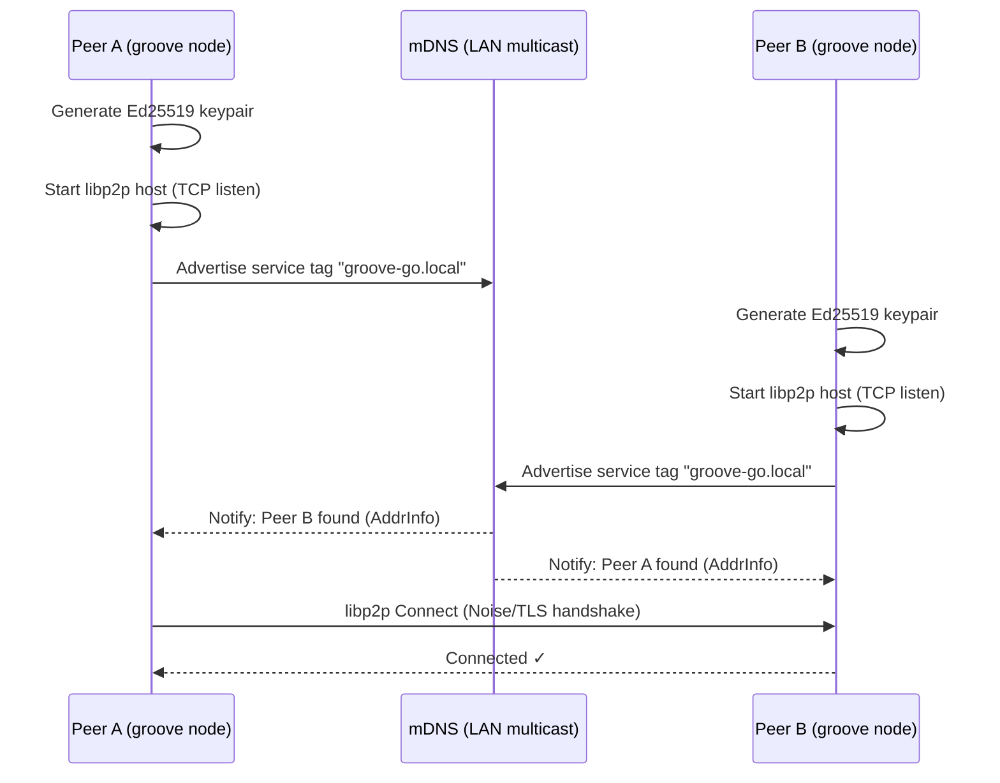
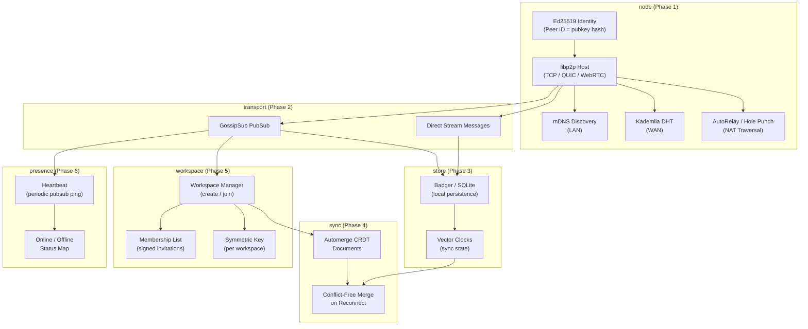
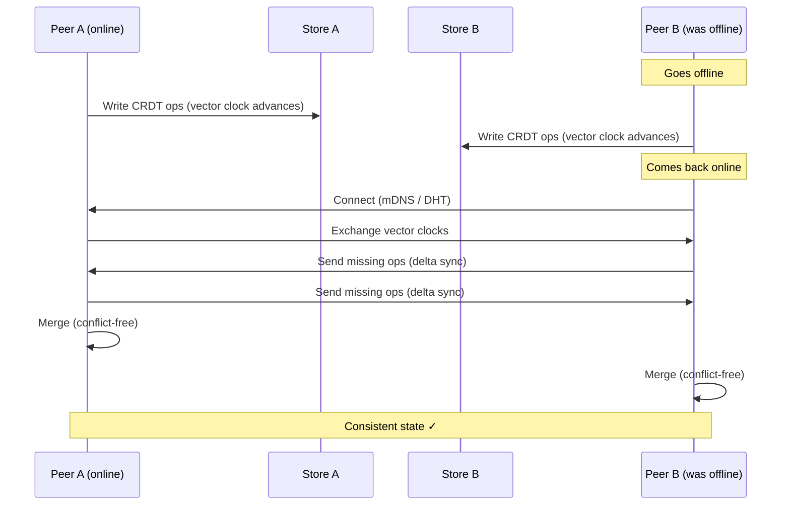

# GrooveGO — Architecture & Flow

## Phase 1 — Node Boot & LAN Discovery

```mermaid
sequenceDiagram
    participant A as Peer A (groove node)
    participant M as mDNS (LAN multicast)
    participant B as Peer B (groove node)

    A->>A: Generate Ed25519 keypair
    A->>A: Start libp2p host (TCP listen)
    A->>M: Advertise service tag "groove-go.local"

    B->>B: Generate Ed25519 keypair
    B->>B: Start libp2p host (TCP listen)
    B->>M: Advertise service tag "groove-go.local"

    M-->>A: Notify: Peer B found (AddrInfo)
    M-->>B: Notify: Peer A found (AddrInfo)

    A->>B: libp2p Connect (Noise/TLS handshake)
    B-->>A: Connected ✓
```

## Full System — Component Interaction (All Phases)

```mermaid
flowchart TD
    subgraph Node["node (Phase 1)"]
        ID["Ed25519 Identity\n(Peer ID = pubkey hash)"]
        HOST["libp2p Host\n(TCP / QUIC / WebRTC)"]
        MDNS["mDNS Discovery\n(LAN)"]
        DHT["Kademlia DHT\n(WAN)"]
        RELAY["AutoRelay / Hole Punch\n(NAT Traversal)"]
        ID --> HOST
        HOST --> MDNS
        HOST --> DHT
        HOST --> RELAY
    end

    subgraph Transport["transport (Phase 2)"]
        PS["GossipSub PubSub"]
        DM["Direct Stream Messages"]
    end

    subgraph Store["store (Phase 3)"]
        DB["Badger / SQLite\n(local persistence)"]
        VCL["Vector Clocks\n(sync state)"]
    end

    subgraph Sync["sync (Phase 4)"]
        CRDT["Automerge CRDT\nDocuments"]
        MERGE["Conflict-Free Merge\non Reconnect"]
        CRDT --> MERGE
    end

    subgraph Workspace["workspace (Phase 5)"]
        WS["Workspace Manager\n(create / join)"]
        MEM["Membership List\n(signed invitations)"]
        SYMKEY["Symmetric Key\n(per workspace)"]
        WS --> MEM
        WS --> SYMKEY
    end

    subgraph Presence["presence (Phase 6)"]
        HB["Heartbeat\n(periodic pubsub ping)"]
        STATUS["Online / Offline\nStatus Map"]
        HB --> STATUS
    end

    HOST --> PS
    HOST --> DM
    PS --> DB
    DM --> DB
    DB --> VCL
    VCL --> MERGE
    PS --> WS
    PS --> HB
    WS --> CRDT
```

## Data Sync — Offline & Reconnect Flow

```mermaid
sequenceDiagram
    participant A as Peer A (online)
    participant DB_A as Store A
    participant DB_B as Store B
    participant B as Peer B (was offline)

    Note over B: Goes offline
    A->>DB_A: Write CRDT ops (vector clock advances)
    B->>DB_B: Write CRDT ops (vector clock advances)

    Note over B: Comes back online
    B->>A: Connect (mDNS / DHT)
    A->>B: Exchange vector clocks
    B->>A: Send missing ops (delta sync)
    A->>B: Send missing ops (delta sync)
    A->>A: Merge (conflict-free)
    B->>B: Merge (conflict-free)
    Note over A,B: Consistent state ✓
```
