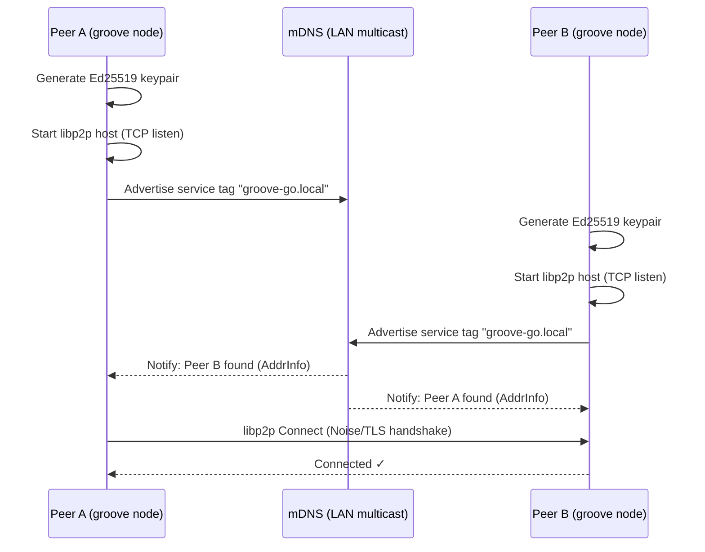
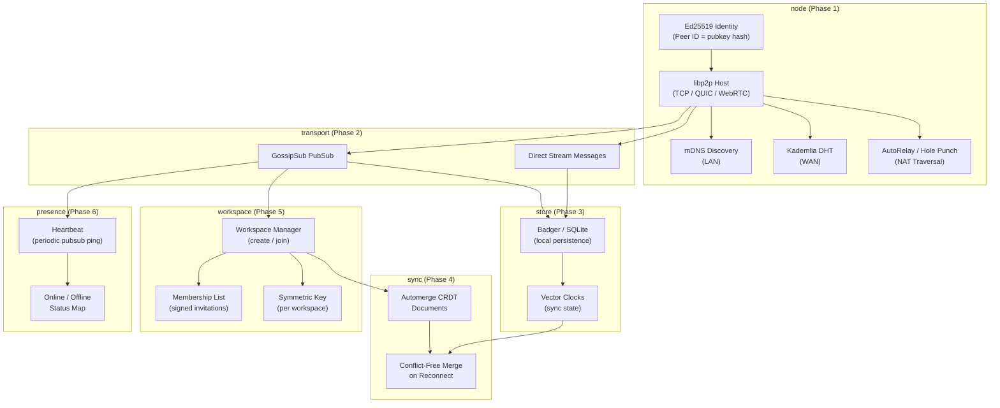
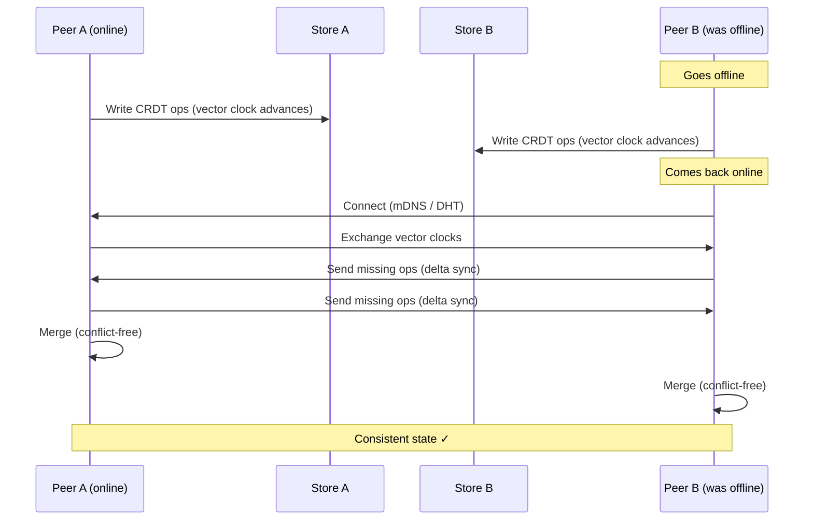

# GrooveGO

A peer-to-peer collaboration platform in Go, inspired by Microsoft Groove. Decentralized shared workspaces with real-time sync, offline capability, presence awareness, and end-to-end encryption — no central server required.

## Vision

GrooveGO brings back the best of Groove's architecture on modern P2P primitives:

- **Decentralized** — peers connect directly, no central broker
- **Offline-first** — CRDT-based sync means you keep working when disconnected
- **Encrypted** — Ed25519 identity + per-workspace symmetric keys
- **LAN & WAN** — mDNS for local discovery, Kademlia DHT for internet-wide peering

## Build Phases

| Phase | Status | Feature |
|-------|--------|---------|
| 1 | ✅ Done | libp2p node bootstrap + mDNS LAN discovery |
| 2 | ✅ Done | GossipSub pubsub — text messaging within workspace topics |
| 3 | ✅ Done | Persistence — Badger local store, replay on reconnect |
| 4 | ✅ Done | Browser web UI + WebSocket bridge + file sharing |
| 5 | ✅ Done | Multi-channel workspace manager + channel sidebar |
| 6 | ✅ Done | Presence — heartbeats, online/offline status |
| 7 | ✅ Done | NAT traversal — AutoRelay + hole punching + relay node |

## Project Structure

```
groove-go/
├── cmd/
│   ├── groove/           # Headless CLI node
│   ├── groove-ui/        # Bubble Tea terminal UI
│   ├── groove-web/       # Browser UI + WebSocket server
│   └── groove-relay/     # VPS relay/bootstrap node
├── internal/
│   ├── node/             # libp2p host, Ed25519 identity, mDNS, DHT
│   ├── workspace/        # Multi-channel workspace manager
│   ├── store/            # Badger persistence + file storage
│   ├── transport/        # GossipSub pubsub, file sharing
│   ├── presence/         # Heartbeat tracker, online/offline status
│   └── web/              # HTTP server, WebSocket bridge, embedded UI
└── Makefile              # Cross-platform build targets
```

## Getting Started

### Option A — Pre-built binaries (no Go required)

Download the appropriate binary for your OS from the [Releases](https://github.com/robouden/GrooveGO/releases) page, or build all platforms at once:

```bash
git clone https://github.com/robouden/GrooveGO.git
cd GrooveGO/groove-go
make all          # builds linux/mac/windows into dist/
```

### Option B — Run from source

**Requirements:** Go 1.22+

```bash
git clone https://github.com/robouden/GrooveGO.git
cd GrooveGO/groove-go
go run ./cmd/groove-web --workspace general
```

---

## Deployment

### 1. Run a relay node on a VPS

The relay helps clients behind NAT find and connect to each other across the internet.

```bash
# Copy binary to VPS (or build from source)
scp dist/groove-relay-linux-amd64 user@YOUR_VPS_IP:~/groove-relay
ssh user@YOUR_VPS_IP "chmod +x ~/groove-relay"

# Open firewall ports (TCP + UDP for QUIC)
sudo ufw allow 4001/tcp
sudo ufw allow 4001/udp

# Start the relay
./groove-relay --port 4001
```

On startup it prints its full multiaddr — copy it, clients need it:

```
[relay] node running — share these addresses with your peers:
  /ip4/1.2.3.4/tcp/4001/p2p/12D3KooWXxxx...
  /ip4/1.2.3.4/udp/4001/quic-v1/p2p/12D3KooWXxxx...
```

**Keep it running with systemd:**

```ini
# /etc/systemd/system/groove-relay.service
[Unit]
Description=Groove Relay Node

[Service]
ExecStart=/home/user/groove-relay --port 4001
Restart=always

[Install]
WantedBy=multi-user.target
```

```bash
sudo systemctl enable --now groove-relay
```

### 2. Connect clients via the relay

Give each client the binary for their platform and the relay address:

```bash
# Linux
./groove-web-linux-amd64 \
  --relay /ip4/1.2.3.4/tcp/4001/p2p/12D3KooWXxxx \
  --workspace general \
  --http :8080

# Mac
./groove-web-mac-arm64 \
  --relay /ip4/1.2.3.4/tcp/4001/p2p/12D3KooWXxxx \
  --workspace general \
  --http :8080
```

Open `http://localhost:8080` in the browser. No Go installation needed on client machines.

| Platform | Binary |
|----------|--------|
| Linux x64 | `groove-web-linux-amd64` |
| Linux ARM64 | `groove-web-linux-arm64` |
| Mac Intel | `groove-web-mac-amd64` |
| Mac Apple Silicon | `groove-web-mac-arm64` |
| Windows | `groove-web-windows-amd64.exe` |

### LAN-only (no relay needed)

On the same local network, peers discover each other automatically via mDNS — no relay or port forwarding required:

```bash
# Just run on each machine, no --relay flag needed
./groove-web-linux-amd64 --workspace general --http :8080
```

## Architecture

### Phase 1 — Node Boot & LAN Discovery



### Full System — Component Interaction (All Phases)



### Data Sync — Offline & Reconnect Flow



Full standalone diagram files are in [diagrams/](diagrams/).

## Key Libraries

| Purpose | Library |
|---------|---------|
| P2P networking | `github.com/libp2p/go-libp2p` |
| Pub/Sub | `github.com/libp2p/go-libp2p-pubsub` |
| DHT discovery | `github.com/libp2p/go-libp2p-kad-dht` |
| Serialization | `google.golang.org/protobuf` |
| Local DB | `github.com/dgraph-io/badger` |
| CRDTs | `github.com/automerge/automerge-go` |

## Connection to Safecast

The CRDT + offline-first design maps naturally onto distributed sensor networks. bGeigieZen devices could form mesh workspaces, syncing measurement data peer-to-peer without the central API, then reconciling with the server when connectivity allows.

## License

MIT
