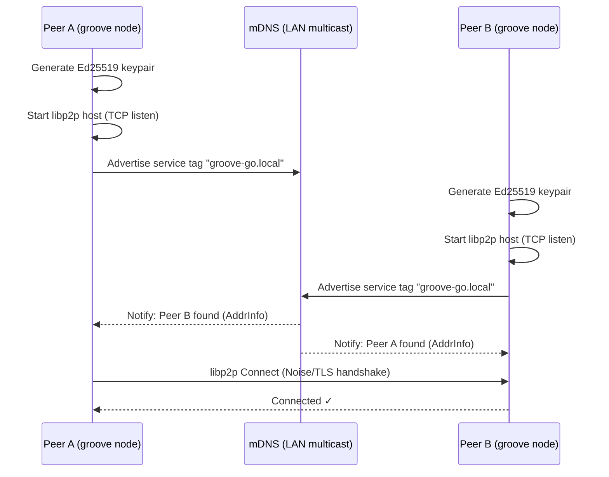
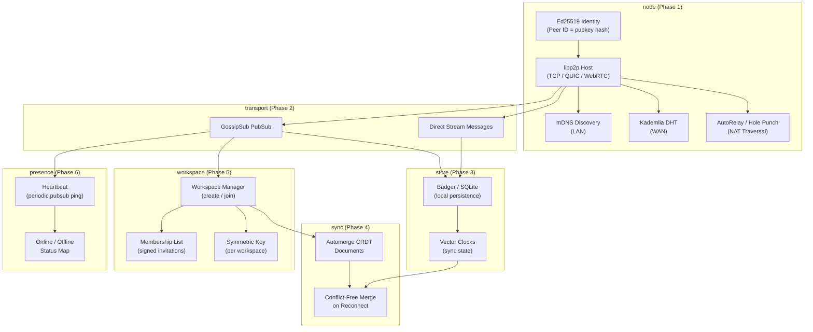
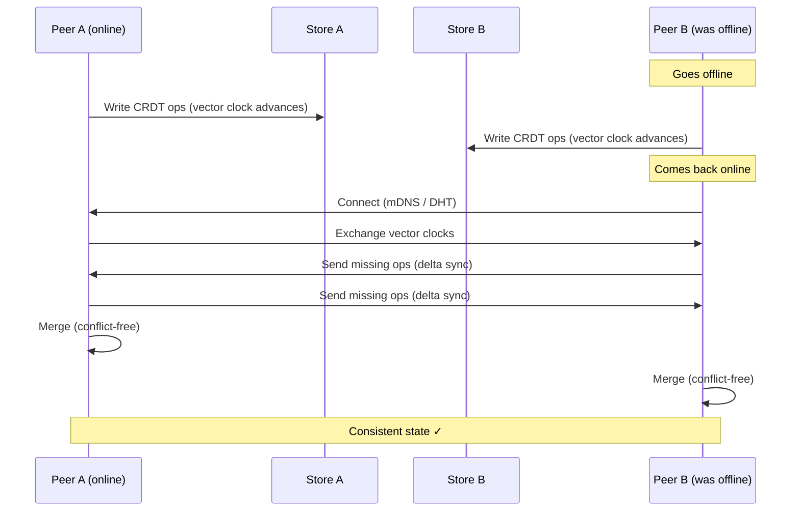

# GrooveGO

A peer-to-peer collaboration platform in Go, inspired by Microsoft Groove. Decentralized shared workspaces with real-time sync, offline capability, presence awareness, and end-to-end encryption — no central server required.

## Vision

GrooveGO brings back the best of Groove's architecture on modern P2P primitives:

- **Decentralized** — peers connect directly, no central broker
- **Offline-first** — CRDT-based sync means you keep working when disconnected
- **Encrypted** — Ed25519 identity + per-workspace symmetric keys
- **LAN & WAN** — mDNS for local discovery, Kademlia DHT for internet-wide peering

## Build Phases

| Phase | Status | Feature |
|-------|--------|---------|
| 1 | ✅ Done | libp2p node bootstrap + mDNS LAN discovery |
| 2 | 🔜 Next | GossipSub pubsub — text messaging within workspace topics |
| 3 | ⬜ | Persistence — Badger/SQLite local store, replay on reconnect |
| 4 | ⬜ | CRDT documents — conflict-free shared state (Automerge) |
| 5 | ⬜ | Workspace manager — membership, signed invitations |
| 6 | ⬜ | Presence — heartbeats, online/offline status |
| 7 | ⬜ | NAT traversal — AutoRelay + hole punching for WAN peers |

## Project Structure

```
groove-go/
├── cmd/groove/main.go        # Entry point (--port flag, graceful shutdown)
├── internal/
│   ├── node/                 # libp2p host, Ed25519 identity, mDNS
│   ├── workspace/            # Workspace CRUD, membership (Phase 5)
│   ├── sync/                 # CRDT engine, vector clocks (Phase 4)
│   ├── store/                # Local persistence (Phase 3)
│   ├── transport/            # GossipSub, direct messaging (Phase 2)
│   └── presence/             # Online/offline tracking (Phase 6)
└── pkg/protocol/             # Protobuf message definitions
```

## Getting Started

**Requirements:** Go 1.22+

```bash
git clone https://github.com/robouden/GrooveGO.git
cd GrooveGO/groove-go
go mod download
```

**Run two nodes on the same LAN** — they will discover each other automatically via mDNS:

```bash
# Terminal 1
go run ./cmd/groove --port 9000

# Terminal 2
go run ./cmd/groove --port 9001
```

Each node prints its peer ID and listen address on startup. Once discovered, peers connect automatically.

## Architecture

### Phase 1 — Node Boot & LAN Discovery



### Full System — Component Interaction (All Phases)



### Data Sync — Offline & Reconnect Flow



Full standalone diagram files are in [diagrams/](diagrams/).

## Key Libraries

| Purpose | Library |
|---------|---------|
| P2P networking | `github.com/libp2p/go-libp2p` |
| Pub/Sub | `github.com/libp2p/go-libp2p-pubsub` |
| DHT discovery | `github.com/libp2p/go-libp2p-kad-dht` |
| Serialization | `google.golang.org/protobuf` |
| Local DB | `github.com/dgraph-io/badger` |
| CRDTs | `github.com/automerge/automerge-go` |

## Connection to Safecast

The CRDT + offline-first design maps naturally onto distributed sensor networks. bGeigieZen devices could form mesh workspaces, syncing measurement data peer-to-peer without the central API, then reconciling with the server when connectivity allows.

## License

MIT
